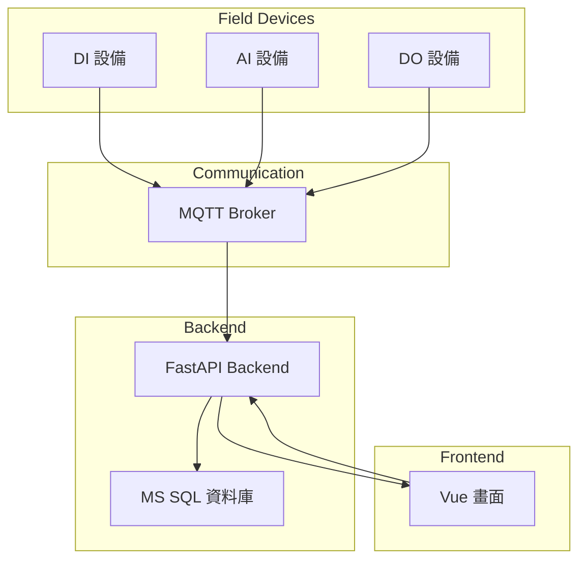
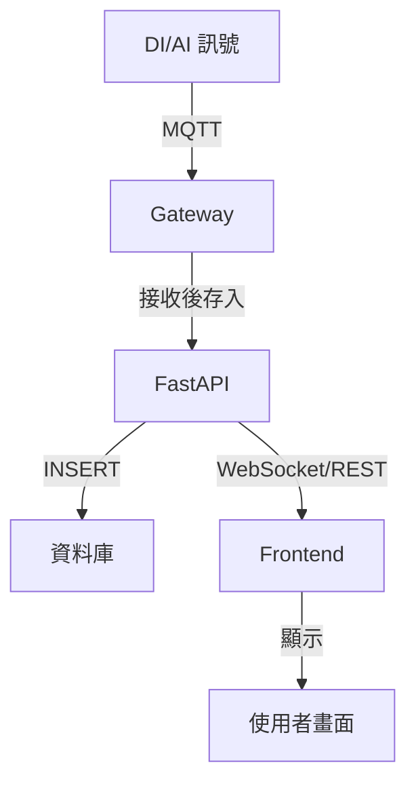
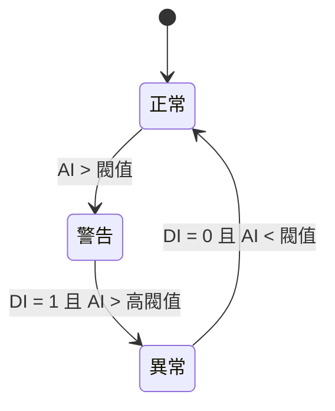
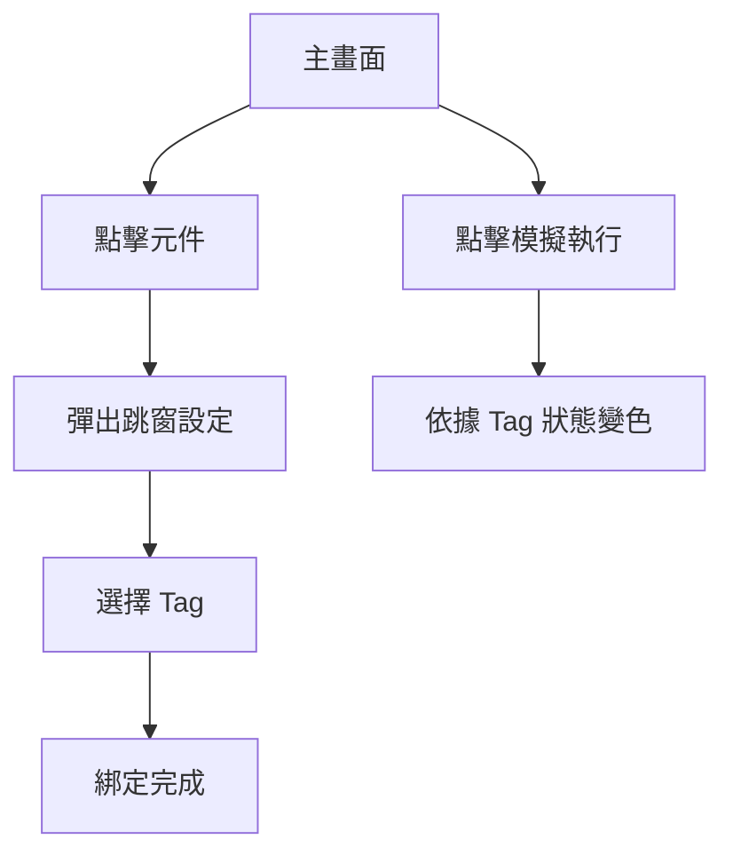
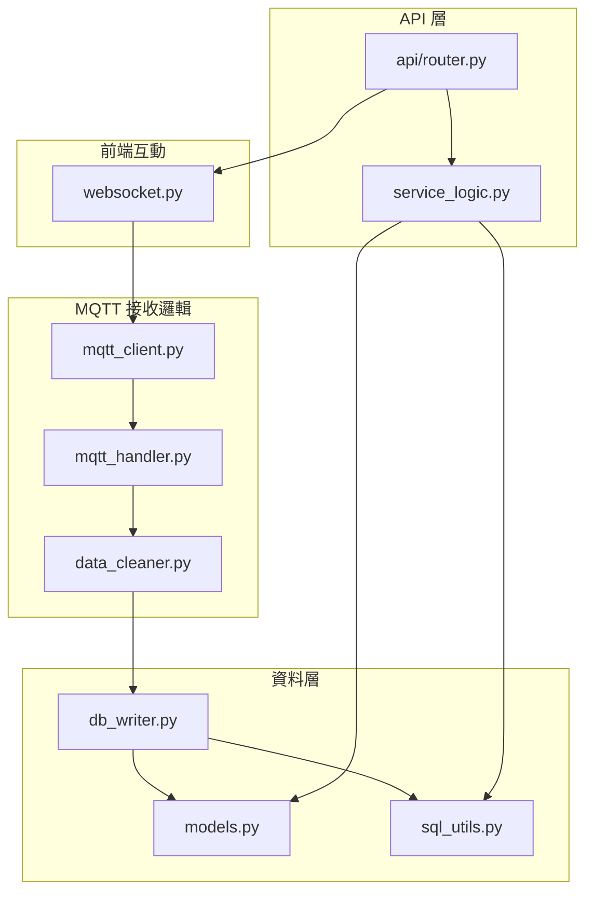

```
⚡ 電力系統開發前該畫哪些 Flow？（含圖例說明）
✅ 建議畫這 4 種圖（+ Bonus）

圖類型	說明	工具建議
1️⃣ 系統架構圖	畫出所有模組 & 資料來源，例如 MQTT、資料庫、前端	draw.io / Mermaid
2️⃣ 資料流程圖 (DFD)	資料怎麼流進來、怎麼處理、去哪裡	draw.io / Mermaid
3️⃣ 狀態流程圖	DI/AI/DO 狀態變化、邏輯運算流程（AND/OR/XOR）	Mermaid / Whimsical
4️⃣ UI Flow（頁面邏輯）	按鈕點擊後做什麼、跳窗、CRUD 操作	Figma / draw.io
🔥 Bonus：模組責任圖	哪個檔案負責什麼邏輯、API 區塊	Notion / Markdown / Mermaid
```

## 1️⃣ 系統架構圖
``` text
📌 這張圖清楚表達：

各個電力裝置如何進到系統

API 串接資料庫與前端的角色

雙向溝通端點
```


## 2️⃣ 資料流程圖 (DFD)
``` text
你可以用這種方式標記：

資料來源

傳輸方式

存放與呈現的流程
```


## 3️⃣ DI/AI 狀態邏輯流程圖
``` text
這張圖可以用來表示：

DI/AI 狀態變化的邏輯流程

邏輯運算流程（AND/OR/XOR）

例如：

DI = 1 且 AI > 閥值 → 警告

DI = 0 且 AI < 閥值 → 正常

DI = 1 且 AI > 高閥值 → 異常
``` 


## 4️⃣ UI Flow + 操作流程
``` text
畫出「使用者操作流程」，你才知道：

要設哪些 API

哪些元件之間要互動
```



## 🔥 Bonus：模組責任圖
``` text
它是用來標示：

每個程式模組（.py）負責什麼邏輯

誰是「資料處理」、誰是「資料庫層」、誰是「API 出口」

有助於模組化、分工、避免邏輯混雜
```

``` text
模組名稱 | 負責什麼
mqtt_client.py | 建立 MQTT 連線、訂閱主題
mqtt_handler.py | 收到 MQTT 資料後進一步處理
data_cleaner.py | 清洗資料、轉換格式
db_writer.py | 寫入資料庫邏輯
models.py | SQLAlchemy 資料模型
sql_utils.py | 資料庫查詢工具函式
api/router.py | FastAPI API 出口
service_logic.py | 接收 API 請求、處理邏輯、呼叫資料層
websocket.py | 推送即時資料到前端
```


